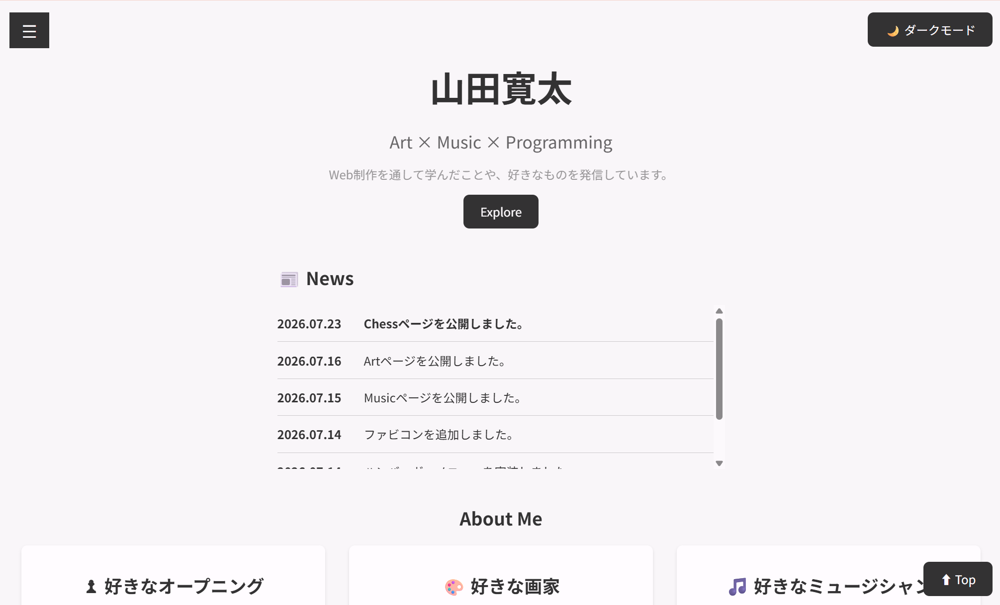
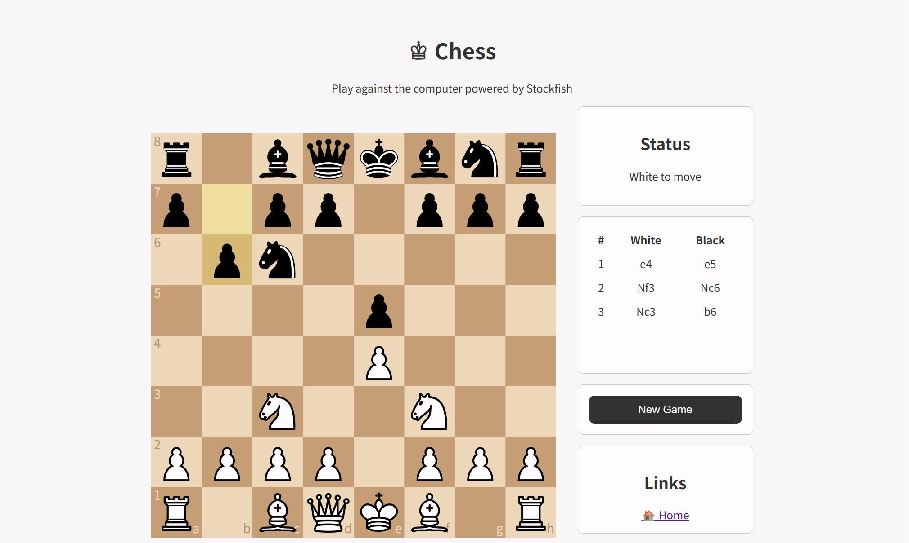

# Portfolio Website

個人制作のポートフォリオサイトです。

HTML・CSS・JavaScriptの学習を兼ねて制作しており、
好きな美術・音楽の紹介や、ブラウザで遊べるチェスアプリを公開しています。

## Website

https://kantayamadamagic.github.io/website/

## Features

- 🎨 Art
  - 好きな画家・作品の紹介

- 🎵 Music
  - 好きなミュージシャンの紹介

- ♟ Chess
  - コンピュータ対戦
  - 難易度選択
  - 棋譜表示
  - 取った駒の表示
  - ダークモード
  - レスポンシブ対応

## Technologies

- HTML5
- CSS3
- JavaScript
- GitHub Pages
- cm-chessboard
- chess.js
- Chess-API

## Project Structure

```
website/
├── css/
├── images/
├── js/
├── pages/
│   ├── art.html
│   └── music.html
├── chess/
└── index.html
```

## Future Improvements

- コンピュータAIの強化
- Artページの拡充
- Musicページの拡充
- デザインのブラッシュアップ

## Screenshot



